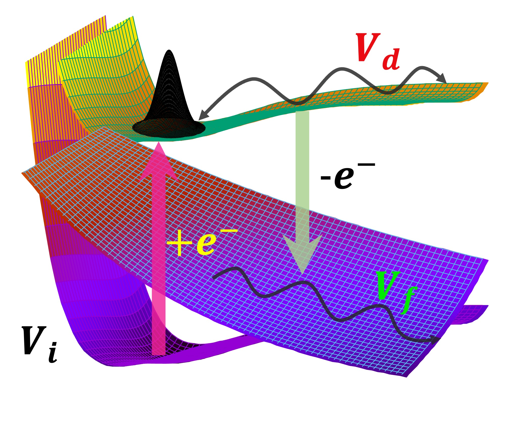

# WP-DYNAMICS-Autoionization

## 2D Quantum dynamics: Wave packet propagation on autoionizing complex potential energy surfaces (3 states model)

## Cederbaum, Tarantelli three state model $^{1, 2}$ : Metastable ($V_d-i\frac{\Gamma}{2}$), Final decaying channel ($V_f$), Initial state ($V_i$)

<p align="center">
    
</p>

> Initial wave-packet $\Phi_0$ is created on the Initial state ($V_i$) and excited to the metastable state

```math
\vec{\phi}(t)=e^{i\hat{H}t/\hbar}\binom{\Phi_0}{0}; \hat{H} = \hat{U}+\hat{T}
```
> and propagated by the complex Hamiltonian $\hat{H}$ comprising of potential $\hat{U}$ and nuclear kinetic energy $\hat{T}$ matrix.

> $\hat{U}$ is a $2\times2$ matrix whose diagonal terms reprsent metastable state and final state respectively, the off-diagonal element signifies the irreversible decay of the metastable state to the final state by emitting an $e^-$. The autoiionized $e^-$ bears a kinetic energy of $E_{kin}$

```math
\hat{U}\equiv\begin{pmatrix}
\hat{V_d}-i\frac{\hat{\Gamma}}{2} & 0\\ 
\sqrt{\frac{\hat{\Gamma}}{2\pi}} & \hat{V_f}+E_{kin}\hat{I}
\end{pmatrix}
```

>> A Complex Absorbing Potential (**CAP**) is added to $V_f$ in order to avoid the artificial reflections from the edge of the grid ```CAP_FUNC```.

> Cross-section spectrum for autoionized electron energy can be evaluated as final state norm for $t\rightarrow\infty$, meaning enough simulation time has passed

```math
\sigma(E_{kin})=\lim_{t\rightarrow\infty}\left < \phi_f(t)|\phi_f(t)\right >
```

# Reference

<a id="1">[1]</a> 
L. S. Cederbaum, F. Tarantelli , 
Nuclear dynamics of decaying states: A time-dependent formulation ,
J. Chem. Phys. 98 (12), 1993.


<a id="2">[2]</a> 
N. Moiseyev, S. Scheit and L. S. Cederbaum,
Non-Hermitian quantum mechanics: Wave packet propagation on autoionizing potential energy surfaces,
J. Chem. Phys., 121 (2), 2004.


## Run the program with fortran complier(``gfortran>9.4``/ ``intel fortran``)

### Tested on Morse like potentials.

#### Tested on Linux Ubuntu-18.04 system

    make
    ./runQD2D
    


### Source programs are located in ```./src/```

> This is the main program that performs the 2D quantum dynamics (QD) on metastable state and produces cross-section, norm profiles like variables.

        ./src/QD2D.f90

>> External file containing sorted data of potential energies along X-Y 2D grid are required.
        
        ./data/input/POTFUNC              
        
>>(Formatted as: $X$, $Y$, $V_d(X, Y)$, $V_f(X, Y)$, $\Phi_0 (X, Y)(t=0)$, **CAP (X, Y)**), needs to be provided in that order.


> A module that contains dynamical variable info (grid size, time of simulation *etc*). Edit this file accordingly.

        ./src/CONST.f90

### Generated binary files (``.o``) are located in ```./bin/```

        CONST.o MACHINARY.o VARIABLE.o fftpack5.1.o INTEGRATE.o QD2D.o

### Outputs files are stored in ``./data/outputs/``

>>> Norm Profile: Time (fs), Norm in $V_d$, Norm in $V_f$, Norm thorugh CAP

        ./data/outputs/NORM_PROFILE_MODEL_MORSE_*fs
        
>>> Kinetic energy distribuition: $E_{kin}$ vs $\sigma(E_{kin})$

        ./data/outputs/EKIN_DISTR_MODEL_MORSE_*fs
        
#### Reference fortran subroutines

> FFT fortran subroutine file is in ``./libs/fftpack5.1f``

<a id="1">[Developer]</a> 
Paul N. Swarztrauber, National Center for Atmospheric Research, Boulder, Colorado, 
P.N. Swarztrauber, Vectorizing the FFTs, in Parallel Computations (G. Rodrigue, ed.),
Academic Press, 1982, pp. 51--83.
https://www.netlib.org/fftpack/


> Integration in 2D, 1D subroutine is in ```./libs/INTEGRATE.f```

<a id="2">[Developer]</a> 
H.M.Antia
Theoretical Astrophysics Group, Tata Institute of Fundamental Research, Mumbai, India, 
NUMERICAL METHODS FOR SCIENTISTS AND ENGINEERS, THIRD EDITION , Published by Hindustan Book Agency, New Delhi 110016, India.
https://www.tifr.res.in/~antia/nmse3.html
